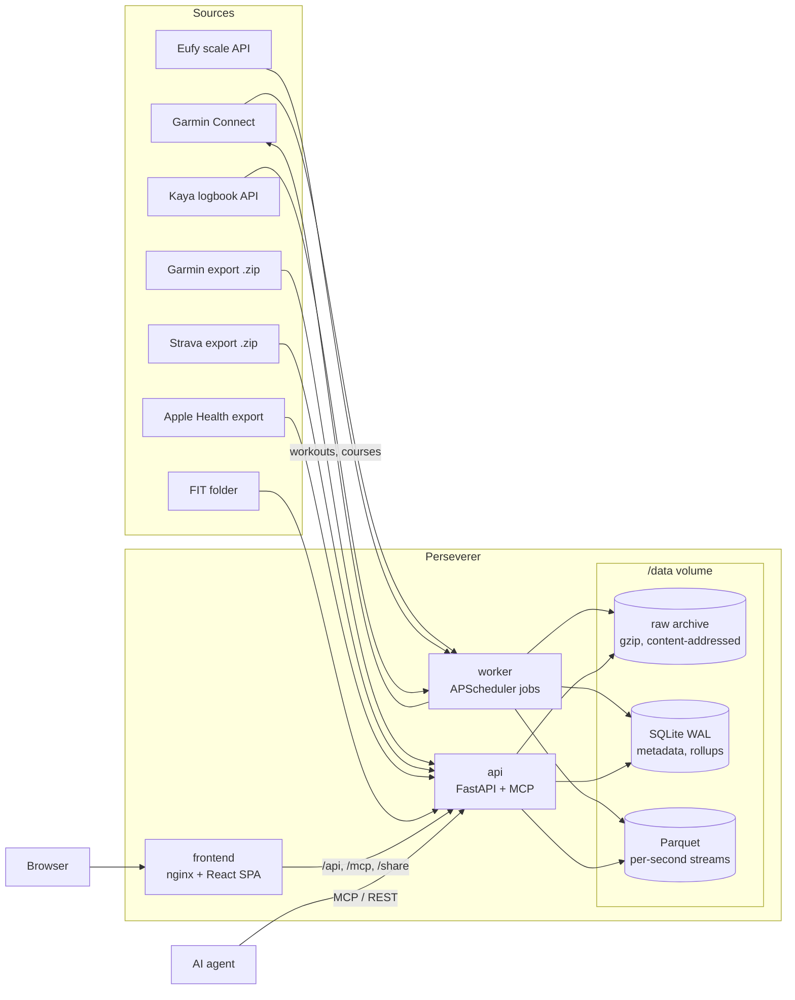

# Architecture

The goal of Perseverer is to replace Garmin Connect, Strava and intervals.icu with a single,
self-hosted app: the device and health data of the first, the activity history and records of the
second, and the training analytics and workout planning of the third, in one archive you own.

Perseverer is a self-hosted platform that collects everything a sports watch and its companion
services know about you, keeps the original bytes forever, and turns them into a fast web app, a
REST API and an MCP server an AI agent can work with.

This document describes how the system is built and why. For setup and operations see
[DEPLOY.md](DEPLOY.md); for every stored field see [DATA_DICTIONARY.md](DATA_DICTIONARY.md); for
the HTTP interface see [API.md](API.md).

- [System overview](#system-overview)
- [Core principles](#core-principles)
- [Storage](#storage)
- [Ingestion](#ingestion)
- [Derived data](#derived-data)
- [Analytics](#analytics)
- [Writing back to Garmin](#writing-back-to-garmin)
- [REST API](#rest-api)
- [MCP server](#mcp-server)
- [Authentication and security](#authentication-and-security)
- [Frontend](#frontend)
- [Worker and schedules](#worker-and-schedules)
- [Notifications and sharing](#notifications-and-sharing)
- [Multiple athletes](#multiple-athletes)
- [Performance](#performance)
- [Configuration](#configuration)
- [Deployment topology](#deployment-topology)
- [Testing and CI](#testing-and-ci)
- [Repository layout](#repository-layout)
- [Design decisions](#design-decisions)

---

## System overview

Three containers share one data directory:



| Container | Role |
|---|---|
| `api` | FastAPI app: REST API under `/api/v1`, MCP server at `/mcp`, OAuth endpoints, public share pages and calendar feed, Settings-page background jobs (sync now, rebuild, bulk import). Runs two uvicorn workers. |
| `worker` | APScheduler process: daily Garmin/Eufy/Kaya sync and staleness check, daily backup, daily workout push to Garmin, weekly and monthly email reports. |
| `frontend` | nginx serving the built React SPA, and reverse-proxying `/api/`, `/mcp`, `/share/` and the OAuth paths to `api`, so the whole app lives on one origin. |

All three images are built in CI and pulled by the production server; nothing is ever built on
the server itself.

## Core principles

These hold everywhere in the codebase and are the first thing to check when changing it.

1. **Raw first.** Every byte fetched from any vendor (FIT/TCX/GPX files, and the raw JSON of every
   HTTP response with its request URL, timestamp, status and SHA-256) is archived verbatim
   *before* it is parsed. Parsing is a pure function of that archive, so the entire database can
   be re-derived (`sync rebuild`) without contacting any vendor again.
2. **Never drop an unknown field.** Any FIT field, FIT message type or JSON key a parser doesn't
   map is registered in `metric_definition` rather than discarded.
3. **Idempotent ingestion.** Content hashing plus upserts: running any sync or import twice is a
   no-op.
4. **Provenance per field.** Every stored value records its source; when two sources describe the
   same thing, both are kept and a documented priority decides what is shown.
5. **Never destructive.** No sync or migration deletes raw data. Deletion is soft
   (`deleted_at`), and athlete corrections are stored as durable overrides, not edits.
6. **SI units in storage** (m, s, m/s, kg, °C, W, bpm), converted only at the presentation layer.
   Timestamps are stored as UTC plus the local UTC offset; every `DateTime` column is a naive
   datetime that is implicitly UTC (SQLite does not round-trip `tzinfo`).
7. **Additive schema evolution.** A new metric or activity type needs no migration and no code,
   only a `metric_definition` row, which parsers create on their own.
8. **Read from rollups, never scan per request.** Dashboards and calendars read precomputed
   `*_rollup` tables refreshed at ingest time.

## Storage

Everything lives under one data directory (`/data` in the containers), so a backup is one
directory and the archive is browsable with ordinary tools.

| Layer | Location | Holds | Why |
|---|---|---|---|
| Raw archive | `raw/<sha[:2]>/<sha>.gz` + `<sha>.json` sidecar, table `raw_object` | Every vendor response and file, gzipped, immutable, per-athlete content addressing | The source of truth. The JSON sidecar (not the SQLite row) is the durable catalog, so a rebuild works even after deleting the database. |
| SQLite (WAL) | `perseverer.db` | Activities, laps, splits, health observations, sleep, rollups, notes, goals, plans, config | Single file, transactional, no server; WAL lets the api and worker read while one writes. |
| Parquet | `parquet/<athlete>/<activity>.parquet` and monthly health-stream files | Full-resolution per-second activity streams and intraday health series (body battery) | Columnar, compressed, cheap to scan; never rows in SQLite. |
| DuckDB | in-process, read-only over SQLite + Parquet | Stream downsampling and multi-file scans | One SQL statement replaces Python loops for the few queries that need it. |
| Token stores | `garmin_tokens/<athlete>/`, `kaya_tokens/<athlete>/` | Vendor session tokens | Credentials are never stored; see [Writing back to Garmin](#writing-back-to-garmin). |

The schema is SQLAlchemy Core (no ORM), defined in one file, `db/schema.py`, and migrated with
Alembic. Every data table carries `athlete_id`, except the shared catalogs (`athlete`,
`metric_definition`, `oauth_client`); a schema test enforces this.

Main table groups (see [DATA_DICTIONARY.md](DATA_DICTIONARY.md) for every column):

- **Archive and runs:** `raw_object`, `ingest_run`, `metric_definition`, `merge_decision`.
- **Activities:** `activity`, `activity_source_link`, `activity_metric` (EAV for every
  per-activity scalar), `lap`, `split`, `route_geom`, `activity_stream` (Parquet pointer),
  `activity_workout`/`activity_workout_step` (the structured workout a device executed), `device`.
- **Health:** `health_observation` (EAV), `health_stream` (Parquet pointer), `sleep_session`,
  `sleep_stage`.
- **Rollups:** `day_rollup`, `period_rollup`, `health_metric_daily_rollup`,
  `health_metric_period_rollup`, `fitness_daily_rollup`, `performance_daily_rollup`, `insight`.
- **Athlete input:** `note`, `goal`, `duration_goal`, `bouldering_goal`, `planned_workout`,
  `planned_workout_step`, `planned_race`, `shoe`, `athlete_default_shoe`, `blood_test_result`,
  `kaya_climb_note`.
- **Durable overrides:** `activity_sport_override`, `activity_trim_override`,
  `activity_merge_override`, `bouldering_route_status_override`, `bouldering_manual_route`,
  `kaya_dismissed_effort`.
- **Kaya logbook:** `kaya_session`, `kaya_ascent`, `kaya_attempt`, `kaya_unsent_climb`.
- **Config and auth:** `athlete`, `athlete_*_config`, `share_link`, `auth_login_attempt`,
  `oauth_client`, `oauth_authorization_code`, `oauth_token`.

## Ingestion

### Adapters

Each source is one adapter implementing the `SourceAdapter` protocol (`health_check`,
`authenticate`, `list_changed`, `fetch_raw`, `parse`). When a vendor changes something, the fix
stays inside its adapter; a vendor change that seems to require a schema or API change means the
abstraction leaked.

| Adapter | Mode | What it brings |
|---|---|---|
| `garmin_connect` | Scheduled, incremental (rolling window) | Activity FIT files; daily summary, sleep (sessions and stages), HRV, training readiness, training status/VO2max/heat-altitude acclimation, hydration, race predictions, lactate threshold, stress and per-minute body battery; cloud-side activity names. |
| `garmin_export` | Manual import (`.zip` or folder) | Full history from Garmin's "Export your data" archive: every FIT file at any depth (including nested zips) and the ~24 wellness JSON report kinds through one generic parser. |
| `strava_export` | Manual import | Strava's export archive: FIT files go through the shared dispatch, GPX/TCX through their own parsers, with `activities.csv` totals and sport classification overlaid. |
| `apple_health_export` | Manual import | Blood pressure, plus weight/BMI/body fat from before a smart scale existed. The whole `export.xml` is archived once and stream-parsed. |
| `eufy` | Scheduled | Body composition from a Eufy smart scale (weight, body fat, muscle and bone mass, water, BMR, visceral fat, metabolic age, protein, BMI). |
| `kaya` | Scheduled | Route-level bouldering logbook (sends, attempts, route names and grades) from the Kaya app, merged into the watch's bouldering sessions. |
| `fit_folder` | Manual or polling watcher | Any folder of FIT files; also the offline test harness for every other adapter. |

Garmin and Kaya are reached through unofficial clients (the `garminconnect` package and Kaya's
private GraphQL API), so both are treated as fragile: rate limited, abort-on-429, never
auto-login.

### One dispatch for every FIT file

Every FIT file, whatever adapter found it, goes through `ingest_dispatch.ingest_fit_bytes`: archive
once, try the activity parser (`fit/parser.py`), fall back to the health parser
(`health/fit_parser.py`). No adapter has its own FIT parser. Health JSON is parsed by
`health/json_parser.py` (one generic flattener plus a few shape-specific parsers), Eufy readings by
`health/eufy_parser.py`, GPX and TCX by `gpx/parser.py` and `tcx/parser.py`.

Parsers produce a `CanonicalBatch` or `HealthBatch`: the activity summary, laps, splits, route,
streams and metrics, plus the list of unrecognised fields to register. Activity streams are
written to Parquet; scalars become `activity_metric` rows under namespaced keys
(`fit.session.avg_heart_rate`, `garmin.daily_summary.totalSteps`, ...).

### Merging sources

The same run often arrives several times (watch FIT via Garmin Connect, again inside a Garmin
export, again in a Strava export). `merge/engine.py::is_same_activity` compares start time, sport
family and duration, independent of source, and every decision is logged in `merge_decision`
with human-readable reasons. Merges are inspectable and reversible from the activity page
(split re-parses the archived bytes of one source). For duplicates the matcher missed, the athlete
can merge two activities by hand and pick, field by field, which side wins.

### Durable overrides and rebuild

`sync rebuild` wipes every derived table and replays the raw archive. Activity ids are fresh ULIDs
on every rebuild, so athlete corrections are keyed by something stable (start time, source
external ids, Kaya route ids) and re-applied at the end of every rebuild:

- sport/sub-sport, race flag, name, fueling (`activity_sport_override`)
- trimmed start/end (`activity_trim_override`)
- manual cross-source merges (`activity_merge_override`)
- bouldering route status/grade corrections and manually added routes
- Kaya sessions and route notes, which live in their own durable tables

### Kaya and Garmin bouldering

Kaya session times are unreliable (often logged after the session), so Kaya sessions are matched
to Garmin bouldering activities by local date. With exactly one Garmin candidate, Kaya supplies
the route list (names, grades, sends and attempts) while Garmin keeps total time, calories, heart
rate and the HR chart; Garmin's own route rows are kept for their timing but superseded for
grades, and efforts Kaya has no record of (coach-set problems, say) are kept as extra routes.
With no candidate, the Kaya session becomes an activity of its own.

## Derived data

All derived data is recomputed from the stored facts, never edited in place.

| Rollup | Grain | Refreshed |
|---|---|---|
| `day_rollup` | athlete × local date: activity totals, sleep | For every date an ingest touched |
| `health_metric_daily_rollup` | athlete × date × metric | Same |
| `period_rollup`, `health_metric_period_rollup` | week (Monday start) and month, rolled up from the daily rows | Same |
| `fitness_daily_rollup` | Fitness (CTL, 42-day), Fatigue (ATL, 7-day) and Form (TSB) from daily training load | Full history on every relevant ingest |
| `performance_daily_rollup` | Rolling VDOT, race predictions, threshold paces and heart rates, max HR | Full history on every relevant ingest |
| `insight` | Rules-based records and flags per athlete | After every sync |

Every ingest path accumulates the local dates it touched and refreshes each once at the end,
bounded by dates, not files. `local_date` is the activity's own local calendar date (UTC start
plus its recorded offset).

Per-activity enrichments are computed once and cached as metrics: VDOT, grade-adjusted pace
(Minetti cost-of-running model), pace bands, transport-mode detection, weather (Open-Meteo
archive, raw response archived), and location names (reverse geocoding, cached).

## Analytics

The analytics are computed from your own data and shown next to, never blended with, Garmin's
own numbers:

- **Fitness & Form:** Coggan/Banister CTL/ATL/TSB over daily training load.
- **VO2max and race predictions:** a 42-day trailing maximum of the Daniels–Gilbert VDOT, inverted
  into 5K/10K/half/marathon times by bisection.
- **Threshold paces and heart rates:** aerobic (73% VO2max) and lactate (88%) thresholds from the
  same model; threshold HR is the median HR of runs near threshold pace, falling back to a
  fraction of max HR.
- **Pace/HR zones:** five zones built from your best race VDOT (two years) and max HR, each HR
  range taken from the real runs that fell in that pace band.
- **Performance curve:** the best sustained pace, grade-adjusted pace or heart rate for every
  duration from 1 s to 2 h across a date range (vectorised two-pointer sliding window over the
  Parquet streams, gap-aware).
- **Race readiness:** recency-weighted weekly volume and long-run compliance against targets for
  the next scheduled race, plus a week-by-week backtest.
- **Eddington number, PR progress, pace trends, training bands:** computed in the browser from the
  full running history.
- **Insights:** deterministic rules (`insights/`) for records over 30/90/180 days, the year and
  12 months (longest, fastest, most climbing, most calories, earliest/latest start, hottest and
  coldest, per sport), personal bests per distance, streaks, load spikes and resting-HR or
  sleep-score anomalies. The activity page computes the same rules bounded to that activity's own
  date, so an old activity never sees later results.

## Writing back to Garmin

Perseverer writes to one third-party account: Garmin Connect.

- **Planned workouts.** Running workouts are written in a compact text syntax (durations,
  distances, `lap` steps, pace/HR/zone targets, cadence, repeat blocks, inline comments), parsed
  identically by `workout_syntax.py` (server) and `workoutSyntax.ts` (live preview). Yoga and
  bouldering are timed placeholders; HIIT and strength workouts use Garmin's 1,527-exercise
  catalog with sets, reps, weights and rests. A daily job pushes everything due within the next
  7 days; any workout can also be pushed on demand.
- **Copy and paste.** Any planned workout (all sports, with its steps, time, duration and
  comments) or the executed structure of a completed run (converted back to workout syntax) can be
  copied and pasted onto another day. The clipboard is per browser (`workoutClipboard.ts`,
  localStorage); a paste opens a normal editable workout, never a link to the source.
- **Courses.** A GPX route attached to a planned run is archived, summarised for the calendar, and
  pushed to Garmin as a **private** course; if Garmin does not confirm it is private, the course
  is deleted and the push refused.
- **Matching.** A planned workout counts as done when the athlete marks it, or when a recorded
  activity of a compatible sport exists on the same day.

Safety rules for every Garmin call:

- Only a token store is ever loaded. Credentials are used in exactly two human-initiated places
  (`sync auth login` and the Settings login form) and are never stored.
- Calls are rate limited (minimum interval plus an hourly cap); an HTTP 429 aborts the whole run
  immediately, with no retry anywhere. Garmin's SSO locks accounts that retry.

## REST API

FastAPI under `/api/v1`, 137 endpoints across 22 routers, all scoped to the authenticated athlete.
The full reference is [API.md](API.md), also served by the frontend at `/api-docs.html`.

| Area | Routers |
|---|---|
| Activities | list and detail, streams (DuckDB-downsampled tiers, optional time window), route, laps/splits, workout, context and comparisons, insights, weather, location, sources/merge/split, trim, corrections, climbing routes and notes |
| Calendar | daily rollups, weekly and monthly periods |
| Health | dashboard (logical metrics merged across sources), observations, intraday streams, sleep, blood tests |
| Fitness & performance | fitness rollup, performance rollup, pace/HR zones, VO2max analysis, race readiness, performance curve |
| Planning | planned workouts (incl. recurring, push, routes), planned races, distance/duration/bouldering goals |
| Gear | shoes, defaults, mileage, alerts |
| Other | notes, insights, weather forecast, settings (credentials, imports, rebuild, jobs), share links, calendar feed, auth |

Conventions: request-time computation is reserved for bounded lookups (one activity, one goal
period, one race); everything list-wide reads rollups. Values the app does not have are `null` or
`available: false`, never fabricated.

## MCP server

The MCP server (`api/mcp_server.py`) is mounted inside the `api` process at `/mcp` (Streamable
HTTP, stateless, so either uvicorn worker can serve any request). Its 74 tools are thin proxies:
each calls the corresponding REST endpoint in-process, so there is one implementation of every
rule. Tools cover reading everything and writing a training plan (planned workouts and races,
goals, notes, blood tests, gear, activity corrections); the workout-syntax grammar is embedded in
the tool descriptions. Settings, credentials and destructive visual-review actions are not exposed.

Clients authenticate with the `X-API-Key` header or through OAuth 2.1 (dynamic client
registration, PKCE, rotating refresh tokens, hashed at rest), so a URL-only connector such as
claude.ai's can sign in with the athlete's normal password on Perseverer's own consent page.

## Authentication and security

- **Credentials:** a password login issuing a JWT, a per-athlete API key (SHA-256 hashed), or the
  deployment's shared API key (for the default athlete). Every request resolves *which* athlete it
  is; nothing is fail-open (no key configured means 503, not public).
- **Brute-force lockout:** five failures in 15 minutes lock a username, stored in SQLite so both
  uvicorn workers share it, with the same response cost as a wrong password.
- **Forgotten passwords:** the login page emails a one-time reset link to the address in the
  athlete's profile (needs SMTP). The link carries a one-hour signed JWT with a `purpose` claim
  and a fingerprint of the current password hash, so it can't be used as a session token and dies
  as soon as the password changes; no reset table is needed. The request endpoint answers the same
  whether or not the account exists, sends after responding, and is rate limited per account
  through the lockout table. Without SMTP, an administrator resets passwords with the CLI.
- **Accounts** are created with the CLI only; there is no self-service signup.
- **Containers:** `api` and `worker` run read-only with `NoNewPrivileges`; every write goes to
  `/data`.
- **Secrets** come from an env file on the server, never the image. Vendor passwords are used once
  to obtain tokens and never stored.
- **Public surfaces** (share pages, calendar feed) are opt-in per token, read only, cache-only for
  paid or rate-limited lookups, and exclude health data.
- **Staleness alerts:** the worker warns (and optionally calls a webhook) when the Garmin sync has
  not succeeded recently or the last full export is old.
- **Dependency audit** (`pip-audit`, `npm audit`) runs in CI on every push.

## Frontend

React 19 + TypeScript (strict) built with Vite; `wouter` for routing, TanStack Query for data,
Recharts for charts, Leaflet with a MapLibre-rendered CARTO vector basemap for maps.

- **Pages:** calendar (day, week, month, year, all time), activities, activity detail, fitness,
  health, map explorer, insights, gear, exercise library, settings.
- **Runtime configuration:** `config.js` (API base URL, map key) is written when the frontend
  container starts, or served by the Vite dev server, from `perseverer.env`, never baked into the
  build, so one image works behind any hostname. An empty API URL means the page's own origin.
- **Single origin:** nginx proxies `/api/`, `/mcp`, `/share/` and the OAuth paths to `api`.
- **PWA:** installable, with an offline app shell; the service worker never intercepts API, MCP,
  share or OAuth navigations.
- **Code splitting:** every page except the week and month calendar views is lazy-loaded, as are
  the exercise catalog and the map libraries, keeping the first load small.
- **Personalization:** week start, 12/24-hour time, km or miles, starting page (calendar view, activity list, or the last
  activity imported), light/dark theme.
- **Design system:** each metric has one hue and icon everywhere (`metricStyle.ts`), light and dark
  themes from shared tokens.
- **Lean payloads:** calendar and sleep requests ask the API to omit per-day health rollups and
  sleep stages the screens never read.

## Worker and schedules

All schedules resolve against `PERSEVERER_SCHEDULE_TIMEZONE` (an IANA zone), so wall-clock times
stay correct across daylight saving.

| Job | Default | What it does |
|---|---|---|
| `daily_garmin_sync` | 04:15 | Per athlete: Garmin Connect sync, Eufy sync, Kaya import, rollups and insights, staleness check, gear replacement alerts. One athlete's failure never stops the others. |
| `daily_backup` | 03:30 | `VACUUM INTO` snapshot of SQLite, then rsync of the database, raw archive and Parquet to a backup host over SSH. |
| `daily_workout_push` | 04:45 | Pushes planned workouts (and courses) due within the push window to Garmin. |
| `weekly_email_report` | Sunday 18:00 | Re-syncs Garmin, then emails the week's summary and the coming week's plan. |
| `monthly_email_report` | Last day of month 18:00 | Emails the month's totals. |

Long Settings-page operations (sync now, rebuild, bulk import) run as FastAPI background tasks in
the `api` container and are polled through the `ingest_run` table.

## Notifications and sharing

- **Email reports** (opt-in per athlete, SMTP configured per deployment): totals and per-sport
  split, daily distance/steps/sleep bars, each run with highlights, the week before for
  comparison, the coming week day by day with forecast and planned workouts, notes, and upcoming
  races. HTML is email-client-safe (inline styles, pixel widths) with a plaintext twin.
- **Share links:** a token gives read-only public access to one activity or one period,
  server-rendered to mirror the app's own pages (stats, charts with hover, route map with
  playback, splits), without health data.
- **Calendar feed:** an iCalendar URL of planned workouts and races for Google Calendar or any
  subscriber.

## Multiple athletes

Every table and query is scoped by `athlete_id`. A second athlete needs only a row, credentials
and their own vendor logins; each athlete has their own Garmin and Kaya token store and Eufy
config, and every worker job loops over all athletes.

## Performance

- Dashboards read rollups; request-time computation is bounded to one item.
- Child tables are indexed on their parent id (`lap`, `split`, workout steps) as well as on their
  athlete-scoped unique key; every new access pattern is checked with `EXPLAIN QUERY PLAN`
  against real data.
- Stream downsampling is one DuckDB bucket-averaging statement per request, sized to the
  requested window.
- Hot numeric paths (performance curve, grade-adjusted distance) are vectorised with NumPy.
- The frontend fetches a long daily series once and windows it client-side; navigation needs no
  further requests.

## Configuration

Everything deployment-specific is in one file, `perseverer.env` (template:
`perseverer.env.example`): the public URL, secrets, time zone, image location, host data
directory, ports, optional integrations and tuning. It is read by the settings loader
(`config.py`, then real environment variables override it), the Vite dev server, Docker/Podman
Compose (`env_file` plus `--env-file`), the frontend container (`config.js` and the nginx
upstream, rendered at start) and `scripts/install-production.sh`, which renders the Quadlet units
from it and installs it beside them. Every setting has a default in code; the container images
set `PERSEVERER_DATA_DIR=/data` themselves.

## Deployment topology

- **Dev host:** Podman Desktop with Compose for the full stack, or the API under uvicorn and the
  frontend under Vite for day-to-day work.
- **Production server:** rootless Podman with systemd Quadlet units, one unit per container,
  `AutoUpdate=registry` pulling new images from GHCR, behind an existing TLS-terminating reverse
  proxy.
- **Images** are built only in CI (or on the dev host) and pushed to GHCR.

See [DEPLOY.md](DEPLOY.md) for the full procedure.

## Testing and CI

- Python: pytest (about 1,600 tests, real FIT fixtures, fake vendor clients, never the network),
  Ruff lint and format, strict mypy.
- Frontend: Vitest with Testing Library (about 1,000 tests), TypeScript strict, Prettier,
  production build.
- CI jobs: lint, test, frontend, an AVX-masked import smoke test (QEMU CPU model without AVX), a
  full backup → wipe → restore round trip, and image build and push on `main`.

## Repository layout

```
src/perseverer/
  adapters/       one module per data source (+ base protocol)
  fit/ gpx/ tcx/  activity file parsers
  health/         health parsers (FIT, JSON, Eufy, Apple Health) and ingest
  merge/          cross-source matching
  insights/       rules engine
  api/            FastAPI app, routers, schemas, MCP server, DuckDB access
  auth/           passwords, tokens, API keys, OAuth provider, lockout
  db/             schema, engine, seed
  worker/         scheduler entry point
  *.py            domain modules (rollups, fitness, vdot, gap, weather, goals, sharing, ...)
alembic/          migrations
frontend/src/     React app (pages, components, api client, styles, pure logic modules)
docker/           Dockerfiles, nginx config, frontend entrypoint
quadlet/          systemd Quadlet unit templates for production
tests/            pytest suite and fixtures
scripts/          install-production.sh, code generators and maintenance scripts
```

## Design decisions

The choices below shape the codebase; each states what was chosen and why.

**SQLite + Parquet, not a database server.** One file plus columnar side files is portable,
trivially backed up, needs no service to run, and is fast enough for a lifetime of one person's
data when reads go through rollups. Postgres would add an operational dependency for no gain.

**SQLAlchemy Core, not the ORM.** The workload is bulk upserts and aggregate reads; Core keeps SQL
explicit and fast, with the whole schema in one file.

**Naive UTC datetimes.** SQLite and SQLAlchemy drop `tzinfo` on read, so declaring
`timezone=True` would be a lie. Every `DateTime` is naive UTC by convention, and `local_date` is
stored separately, offset-adjusted.

**Content-addressed raw archive with JSON sidecars.** Addressing by SHA-256 makes re-imports free
no-ops; the sidecar (not the SQLite row) is the catalog, so deleting the database loses nothing.

**Generic parsers over bespoke ones.** Garmin's ~24 wellness JSON report kinds share one
flattener (`garmin.export.<report>.<field>`); unknown fields are registered automatically. New
report kinds or firmware fields appear without code changes.

**Independent analytics, shown beside Garmin's.** Fitness/Form, VO2max, thresholds and race
predictions are computed from the athlete's own data with published models, so they are
explainable and survive a vendor change. Garmin's own figures are stored too and shown alongside,
never reconciled.

**Empirical first, formula as fallback.** Max HR, threshold HR and zone HR ranges come from real
data; age-based formulas (Tanaka) only fill the gap for a new athlete, and the response says which
source was used.

**Never auto-login, abort on 429.** Garmin's SSO locks accounts that retry or re-authenticate
often. The client is never handed credentials, so it cannot fall back to them; a 429 ends the run.

**MCP inside the API process, proxying REST.** One deployment unit, one auth gate, one
implementation of every rule. Stateless Streamable HTTP lets the two uvicorn workers share load
without sticky sessions.

**Runtime frontend configuration.** The API base URL is written at container start, so the same
image works under any hostname and behind split-horizon DNS.

**Rollups everywhere.** Recomputing on ingest (bounded by touched dates; full history only for
the cheap fitness and performance models) keeps every page constant-time regardless of history
length.

**Durable overrides keyed by stable identity.** Corrections survive a full rebuild because they
reference start times, source ids or vendor ids, never the regenerated activity id.

**Build once, pull everywhere.** Images are built in CI; the production server only pulls and
restarts, so a deploy is reproducible and the server stays minimal.

**Quadlet over Compose in production.** systemd units give rootless containers restart policies,
boot start, logs and registry auto-update with no extra daemon.

**Deliberately not built.** An LLM narrative layer over insights (the MCP server lets any agent do
this with full context), server-side image export of charts, and self-service signup.
